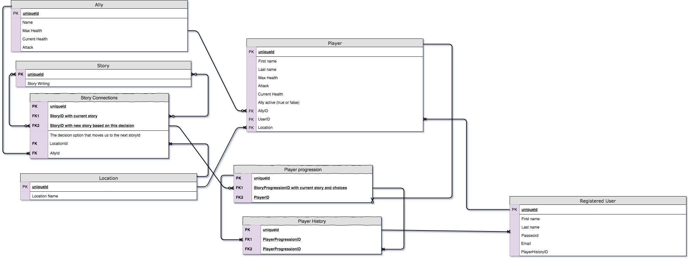

# What is (ProjectName)?

(ProjectName) is a build your own adventure game featuring lovable characters from a celebrated japanese movie studio. I wanted to create something where the players would be able to chose their own path through the games story. Be it playing with their favorite companion through the whole game or by themselves at times. A project where I had created a unique story experience each time a player chose to start the game. I wanted to create a unique text based adventure game using basic front end knowledge. Thus (ProjectName) was born.

## Where I am in the process
1. All ticket issues are in, including some stetch goals for the project.
1. Currently the user can input their player's name and the system generates their random stats and game location.
1. The player is then directed to another page where they can choose their partner character.
1. Once selected the player moves to the game screen.
1. The player's json information is all collected, saved, and filled out accordingly for MVP.
1. You can now complete the story with all of the player selections.
1. There is now damage and a healing that run correctly.
1. There are screens that end the game based on if you lose all your health or beat the game.
1. The story for the first version has been completed.
1. You can now escape with your ally despite not listening to them.
1. There is now damage done to the player if you ignore your ally's directions.

## Dependancies
This project is currently using:
1. React
1. React Router

To download a copy of this code for your own personal computer and get it running correctly please follow along with these detailed steps in your terminal:
 
```
git clone https://github.com/CashewRose/FrontEndCapstone.git

cd FrontEndCapstone

npm install

npm start
```
Open a new tab  or window in your terminal and make sure you are in the FrontEndCapstone folder. From there run this in your terminal:

```
json-server -p 8089 -w data.json
```

<em><strong>Congratulations! You should now have a working copy of this project! </strong></em>

- If you would like to play around and make adjustments in the code open a new terminal tab or window and start your editor! 


## Entity Relationship Diagram

